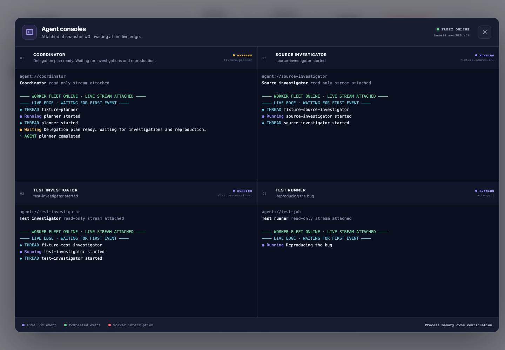

# The Orchestrator Died. The Work Didn’t.

An interactive demonstration and code-trace slideshow show how an agent
execution tree can outlive its operating-system process tree.

The same small TypeScript retry bug runs twice. Act I coordinates Codex turns and tests with promises inside one killable process group. Act II stores coordination in a Temporal Workflow, delegates investigations to Child Workflows, and checkpoints external work through Activity heartbeats. Kill every Worker and Codex/test subprocess; restart the fleet; the durable tree continues.

The browser demo shows the failure and recovery as they happen. A read-only,
four-pane agent console uses xterm.js to display the coordinator, two
investigators, and test runner as they work. The HyperFrames slideshow follows
the implementation from the API request through Workflow replay, with presenter
notes for a detailed Temporal code walkthrough.


## Run the live demo

Requirements: Node 24+, npm, Docker, the `codex` CLI, and a local Codex login.

```bash
npm install
npx playwright install chromium
npm run temporal:up
npm run preflight
npm run build
npm start
```

Open [http://localhost:8787](http://localhost:8787). Temporal’s development UI is exposed at [http://localhost:8233](http://localhost:8233).

Use **Fixture** for deterministic rehearsal. Use **Live Codex** for the authenticated SDK path. The live runner inherits the configured Codex model unless `CODEX_MODEL` is set.

The app is a trusted local demonstration. It uses the existing local ChatGPT-backed Codex login and disables network access inside turns. A public service or CI job should use the authentication and secret-handling method recommended for its automation environment.

## Inspect agent consoles

After a run starts, click **Agent consoles** to open the read-only terminal
dialog. Opening and closing the dialog changes only the browser UI; the run
lifecycle continues independently. Press `Esc` or click **Close agent consoles**
to return focus to the launch control.

Each pane identifies its worker, thread ID, attempt, current status, and SDK
events. The attachment markers distinguish recorded state from new output:

- If you open the dialog before the first event, each pane marks the `LIVE EDGE`
  and appends events as the run produces them.
- If you open the dialog during or after a run, each pane replays the events
  recorded before attachment, marks the `LIVE EDGE`, and then appends new
  events.
- If the Worker fleet stops, the Baseline console reports lost process memory.
  The Temporal console reports that Event History retained durable state.

The console stays available after completion so you can inspect the final
receipt. While work is active, **Kill workers** opens a confirmation dialog.
After completion, the app replaces that action with **Start new run**.

The console view maps each pane to one member of the execution tree.



Key implementation: `src/ui/AgentConsole.tsx`, `@xterm/xterm`, and
`@xterm/addon-fit`.

## Present the code-trace slideshow

The `slideshow/` directory contains a 29-slide HyperFrames deck with a two-slide
Event History branch for deeper questions. The main line follows the code in
execution order:

- `POST /api/runs` starts a managed run and assigns a stable Workflow ID.
- A Worker polls the Task Queue and reconstructs `FixWorkflow` from Event
  History.
- The Workflow schedules Codex and test Activities, then starts two Child
  Workflows for parallel investigation.
- Activity heartbeats checkpoint Codex thread IDs and completed test files. The
  UI reads pending heartbeat details through Temporal's `describe()` API.
- `SIGKILL` removes the Worker process group while the Temporal execution
  remains open.
- A replacement Worker replays recorded results, retries unfinished Activities
  from their heartbeat details, runs the implementation turn, and records
  completion evidence.
- The closing slides separate results recorded in Event History from
  application-owned idempotency and external-effect safety.

Start the presenter from the slideshow directory:

```bash
cd slideshow
npm run present
```

Open the local URL printed by HyperFrames. Click **Present**, or press **P**, to
open the audience tab. Keep the presenter tab for editable notes and the
next-slide preview; share the audience tab during the talk.

Validate the deck after an edit:

```bash
cd slideshow
npm run check
npm run snapshot
```

HyperFrames supports this project as a live slideshow and as per-slide stills.
The project omits a linear video-render command because HyperFrames renders only
the first top-level composition when asked to render this slideshow as one MP4.

## The fixture

Every run receives a fresh copy of `fixture/` under `.demo-runs/<run-id>/workspace`. The fixture contains one defect:

```ts
for (let attempt = 0; attempt <= maxAttempts; attempt += 1)
```

`maxAttempts` is documented and tested as a total call limit, so the correct condition is `<`. Three tests pass before the fix; the limit test fails; all four pass after the one-line patch. The demo never edits this repository or another user repository.

## Before: process-owned orchestration

`BaselineOrchestrator` asks a main Codex thread for an exactly-two-item JSON delegation plan. It concurrently starts two read-only Codex investigations and a test subprocess, resumes the main thread in `workspace-write` mode, and runs final tests.

The process owns the promises, thread mapping, and test progress. `FleetSupervisor.kill()` sends `SIGKILL` only to the detached process group it created and recorded. Restart resets the isolated workspace and creates a fresh in-memory run, so progress returns to zero.

Key implementation: `src/baseline/orchestrator.ts` and `src/baseline/process.ts`.

## After: history-owned orchestration

`FixWorkflow` records the plan and creates one `SubagentWorkflow` per bounded investigation. Codex work and tests stay in Activities because they perform nondeterministic external work.

- `runCodexTurn` heartbeats the Codex thread ID as soon as the SDK emits `thread.started`.
- A five-second heartbeat lease keeps quiet Codex turns live under the 20-second heartbeat timeout.
- An Activity retry uses heartbeat details to resume the local Codex thread.
- If that local session has disappeared, the Activity starts a replacement from the durable prompt and current Git worktree.
- `runTests` runs one file at a time and heartbeats the passed filenames. A retry skips those files.
- Completed Child Workflows and Activities are represented in Event History. Workflow replay consumes their recorded results instead of repeating them.

Key implementation: `src/temporal/workflows.ts`, `src/temporal/activities.ts`, and `src/temporal/worker.ts`.

## Honest failure boundary

Temporal preserves recorded Workflow history; it cannot make every external effect exactly once.

- A completed Activity whose result reached Event History does not rerun during replay.
- An Activity completion lost before the server records it may retry. A Codex turn can therefore make another model call.
- Heartbeats are resumability hints, not Activity completion.
- Explicit Workflow cancellation or termination ends durable orchestration. Killing a Worker only removes compute.
- Codex sessions and run worktrees live on this machine. Disk or machine loss is outside the live demonstration. Production deployment would place required state on durable shared storage.

## API

```text
POST /api/runs                         { mode, runnerMode }
GET  /api/runs/:runId                 current or cached snapshot
POST /api/runs/:runId/kill            kill recorded Worker process group
POST /api/runs/:runId/restart         launch replacement Workers
GET  /api/preflight                   Codex login and Temporal address
```

Stable domain types live in `src/shared/` and `src/temporal/contracts.ts`: `DelegationPlan`, `SubagentAssignment`, `CodexCheckpoint`, `RunSnapshot`, test progress, and final diff evidence.

## Verification

```bash
npm test
npm run test:e2e
npm run check
npm run build
```

The integration suite launches a real ephemeral Temporal server and completes
one Child Workflow. It interrupts another Activity, replaces the Worker, and
proves that the completed child ran once while unfinished work retried. The
Playwright suite launches the API with its own Temporal server and automates
both acts, including the supervisor's real kill/restart endpoints. It also
verifies early and mid-run console attachment, recorded-event replay, the live
edge, focus restoration, offline receipts, and the completed-run control state.
The suite saves browser receipts under `output/playwright/`.

## More detail

- [Slideshow presenter guide](slideshow/README.md)
- [How the durable agent tree works](docs/how-it-works.md)
- [Architecture and state ownership](docs/architecture.md)
- [Talk track and exact demo script](docs/talk-track.md)
- [Verification receipts](docs/verification.md)
