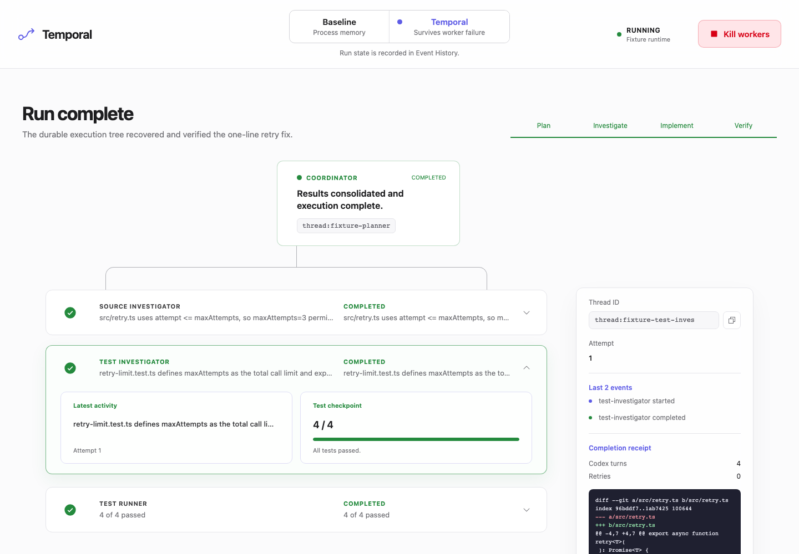

# The Orchestrator Died. The Work Didn’t.

A one-screen demonstration of a precise idea: an agent execution tree should outlive its operating-system process tree.

The same small TypeScript retry bug runs twice. Act I coordinates Codex turns and tests with promises inside one killable process group. Act II stores coordination in a Temporal Workflow, delegates investigations to Child Workflows, and checkpoints external work through Activity heartbeats. Kill every Worker and Codex/test subprocess; restart the fleet; the durable tree continues.



## Run the presentation

Requirements: Node 24+, npm, Docker, the `codex` CLI, and a local Codex login.

```bash
npm install
npx playwright install chromium
npm run temporal:up
npm run preflight
npm run build
npm start
```

Open [http://localhost:8787](http://localhost:8787). Temporal’s development UI is exposed at [http://localhost:8233](http://localhost:8233).

Use **Fixture** for deterministic rehearsal. Use **Live Codex** for the authenticated SDK path. The live runner inherits the configured Codex model unless `CODEX_MODEL` is set.

The app is a trusted local demonstration. It uses the existing local ChatGPT-backed Codex login and disables network access inside turns. A public service or CI job should use the authentication and secret-handling method recommended for its automation environment.

## The fixture

Every run receives a fresh copy of `fixture/` under `.demo-runs/<run-id>/workspace`. The fixture contains one defect:

```ts
for (let attempt = 0; attempt <= maxAttempts; attempt += 1)
```

`maxAttempts` is documented and tested as a total call limit, so the correct condition is `<`. Three tests pass before the fix; the limit test fails; all four pass after the one-line patch. The demo never edits this repository or another user repository.

## Before: process-owned orchestration

`BaselineOrchestrator` asks a main Codex thread for an exactly-two-item JSON delegation plan. It concurrently starts two read-only Codex investigations and a test subprocess, resumes the main thread in `workspace-write` mode, and runs final tests.

The process owns the promises, thread mapping, and test progress. `FleetSupervisor.kill()` sends `SIGKILL` only to the detached process group it created and recorded. Restart resets the isolated workspace and creates a fresh in-memory run, so progress returns to zero.

Key implementation: `src/baseline/orchestrator.ts` and `src/baseline/process.ts`.

## After: history-owned orchestration

`FixWorkflow` records the plan and creates one `SubagentWorkflow` per bounded investigation. Codex work and tests stay in Activities because they perform nondeterministic external work.

- `runCodexTurn` heartbeats the Codex thread ID as soon as the SDK emits `thread.started`.
- A five-second heartbeat lease keeps quiet Codex turns live under the 20-second heartbeat timeout.
- An Activity retry uses heartbeat details to resume the local Codex thread.
- If that local session has disappeared, the Activity starts a replacement from the durable prompt and current Git worktree.
- `runTests` runs one file at a time and heartbeats the passed filenames. A retry skips those files.
- Completed Child Workflows and Activities are represented in Event History. Workflow replay consumes their recorded results instead of repeating them.

Key implementation: `src/temporal/workflows.ts`, `src/temporal/activities.ts`, and `src/temporal/worker.ts`.

## Honest failure boundary

Temporal preserves recorded Workflow history; it cannot make every external effect exactly once.

- A completed Activity whose result reached Event History does not rerun during replay.
- An Activity completion lost before the server records it may retry. A Codex turn can therefore make another model call.
- Heartbeats are resumability hints, not Activity completion.
- Explicit Workflow cancellation or termination ends durable orchestration. Killing a Worker only removes compute.
- Codex sessions and run worktrees live on this machine. Disk or machine loss is outside the live demonstration. Production deployment would place required state on durable shared storage.

## API

```text
POST /api/runs                         { mode, runnerMode }
GET  /api/runs/:runId                 current or cached snapshot
POST /api/runs/:runId/kill            kill recorded Worker process group
POST /api/runs/:runId/restart         launch replacement Workers
GET  /api/preflight                   Codex login and Temporal address
```

Stable domain types live in `src/shared/` and `src/temporal/contracts.ts`: `DelegationPlan`, `SubagentAssignment`, `CodexCheckpoint`, `RunSnapshot`, test progress, and final diff evidence.

## Verification

```bash
npm test
npm run test:e2e
npm run check
npm run build
```

The integration suite launches a real ephemeral Temporal server, completes one Child Workflow, interrupts another Activity, replaces the Worker, and proves the completed child ran once while unfinished work retried. The Playwright suite launches the API with its own Temporal server and automates both acts, including the supervisor’s real kill/restart endpoints. Browser receipts are saved under `output/playwright/`.

See [How the durable agent tree works](docs/how-it-works.md), [Architecture and state ownership](docs/architecture.md), [Talk track and exact demo script](docs/talk-track.md), and [Verification receipts](docs/verification.md).
