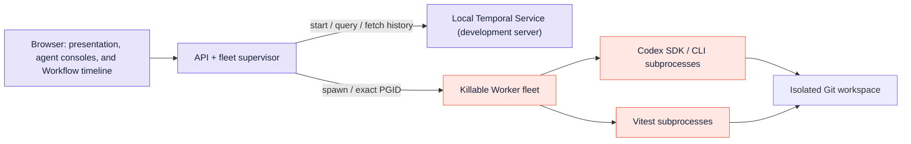
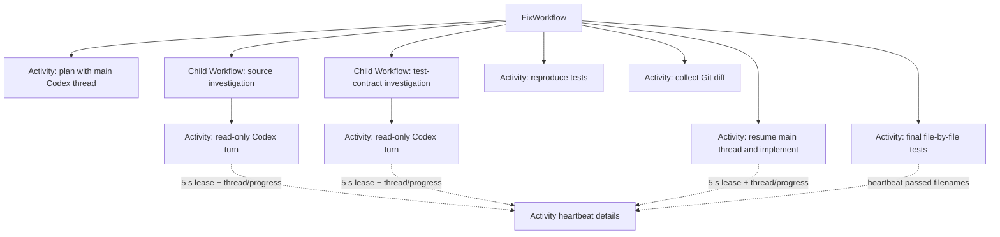
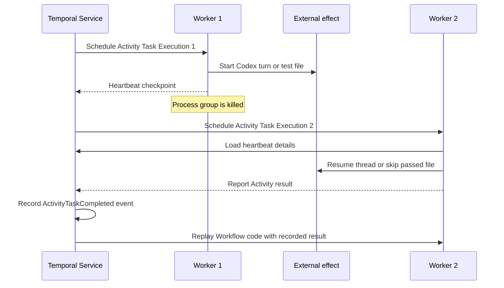

# Architecture and state ownership

## Runtime topology

The browser, API, supervisor, and Temporal Service remain outside the killable group. The supervisor creates a detached Worker group, records its PID/PGID plus an ownership token, validates the target, and signals the negative PGID. Codex and test subprocesses inherit that process group.

## Durable execution tree

The main Workflow is deterministic orchestration. Child Workflows give each logical subagent a durable identity and separate history. Activities contain Codex, filesystem, Git, and test-process effects.

## Live progress projection

The live trace separates in-flight visibility from durable completion. While a
Codex Activity runs, it heartbeats the most recent thread ID and progress event.
A five-second lease repeats the current payload during quiet SDK periods, which
keeps the attempt inside its 20-second heartbeat timeout. The API supervisor
describes the parent Workflow and both Child Workflows, reads their pending
Activity heartbeat details, and overlays those details onto its cached
snapshot. The Workflow cannot read this in-flight heartbeat payload.

When the Activity Function returns, the Worker reports its result. The Temporal
Service records an `ActivityTaskCompleted` event and the result in Event
History. A replacement Worker can replay Workflow code with that recorded
result without executing the completed Activity Definition again.

The supervisor stops projecting pending heartbeats after the cached snapshot
reaches `complete` or `failed`. This terminal-state guard prevents a stale
pending heartbeat from changing a settled node back to `running`.

This split gives the presentation responsive progress while preserving the
semantic boundary between a heartbeat checkpoint and a completed Activity
Execution result. For the full sequence and its recovery limits, see
[How the durable agent tree works](how-it-works.md).

The Workflow timeline follows a third visibility path. The API fetches the
parent and Child Workflow Event Histories and projects their recorded events
into execution spans. This path remains available while the Worker fleet is
offline because history retrieval does not require a Workflow Query.

## State ledger

| State | Owner | Recovery behavior |
|---|---|---|
| Plan, fan-out, completed steps | Temporal Service: Event History | Replayed into the same logical execution tree |
| Codex conversation context | Local Codex session | Resume by heartbeat thread ID; replace from durable assignment if absent |
| Source edits | Git run workspace | Remain across Worker replacement |
| Passed test filenames | Temporal Service: Activity heartbeat details | The next Activity Task Execution skips completed files |
| Live Codex progress | Temporal Service: pending Activity heartbeat details | Supervisor projects progress until the Activity Execution completes |
| UI while Workers are absent | API’s last successful query | Rendered as a visibly frozen snapshot |
| Browser run selection | Browser local storage | Page refresh reloads current snapshots from the surviving API supervisor |
| Workflow timeline | Temporal Service: Event Histories | API can project recorded spans while Workers are absent |
| Worker PID/PGID | Supervisor memory | Validated before targeting the exact detached group |

## Failure semantics

If the external effect finished but the Worker's completion report failed to reach the Temporal Service, the second Activity Task Execution can repeat that effect. Production code can prevent harmful duplicates with effect-specific idempotency or reconciliation.
