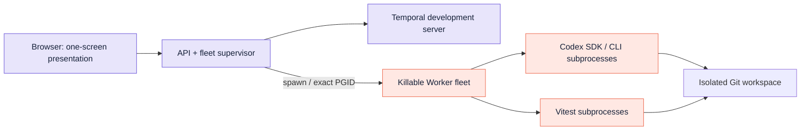
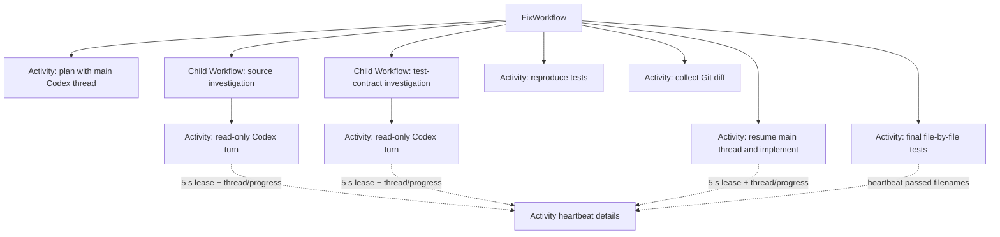
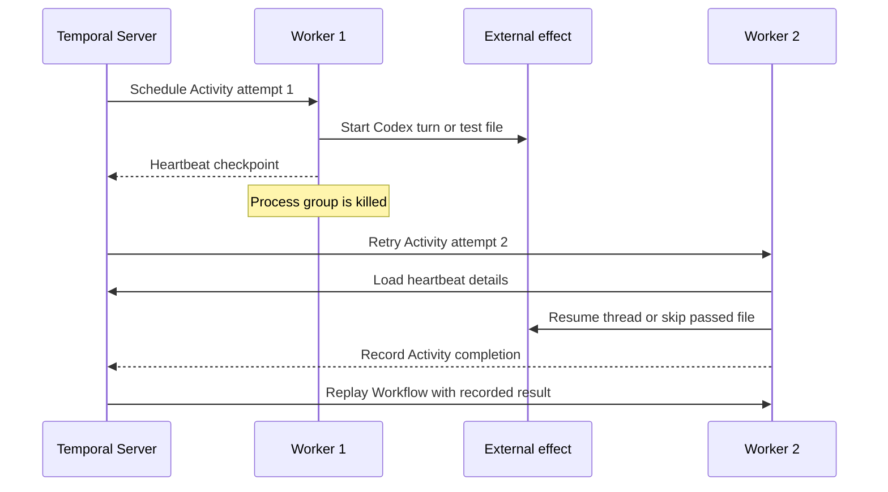

# Architecture and state ownership

## Runtime topology

The browser, API, supervisor, and Temporal server remain outside the killable group. The supervisor creates a detached Worker group, records its PID/PGID plus an ownership token, validates the target, and signals the negative PGID. Codex and test subprocesses inherit that process group.

## Durable execution tree

The main Workflow is deterministic orchestration. Child Workflows give each logical subagent a durable identity and separate history. Activities contain Codex, filesystem, Git, and test-process effects.

## Live progress projection

The live trace separates in-flight visibility from durable completion. While a
Codex Activity runs, it heartbeats the most recent thread ID and progress event.
A five-second lease repeats the current payload during quiet SDK periods, which
keeps the attempt inside its 20-second heartbeat timeout. The API supervisor
describes the parent Workflow and both Child Workflows, reads their pending
Activity heartbeat details, and overlays those details onto its cached
snapshot. The Workflow cannot read this in-flight heartbeat payload.

When the Activity completes, it returns its recent trace with the Codex result.
The Workflow applies that result to its snapshot, and Event History records the
Activity completion. A replacement Worker can replay the recorded result
without rerunning the completed Activity.

The supervisor stops projecting pending heartbeats after the cached snapshot
reaches `complete` or `failed`. This terminal-state guard prevents a stale
pending heartbeat from changing a settled node back to `running`.

This split gives the presentation responsive progress while preserving the
semantic boundary between a heartbeat checkpoint and a completed Activity
result. For the full sequence and its recovery limits, see
[How the durable agent tree works](how-it-works.md).

## State ledger

| State | Owner | Recovery behavior |
|---|---|---|
| Plan, fan-out, completed steps | Temporal Event History | Replayed into the same logical execution tree |
| Codex conversation context | Local Codex session | Resume by heartbeat thread ID; replace from durable assignment if absent |
| Source edits | Git run workspace | Remain across Worker replacement |
| Passed test filenames | Activity heartbeat details | Retried Activity skips completed files |
| Live Codex progress | Pending Activity heartbeat details | Supervisor projects progress until the Activity completes |
| UI while Workers are absent | API’s last successful query | Rendered as a visibly frozen snapshot |
| Worker PID/PGID | Supervisor memory | Validated before targeting the exact detached group |

## Failure semantics

If the external effect finished and Activity completion never reached Temporal, attempt 2 can repeat that effect. Application-level idempotency remains required for consequential effects.
