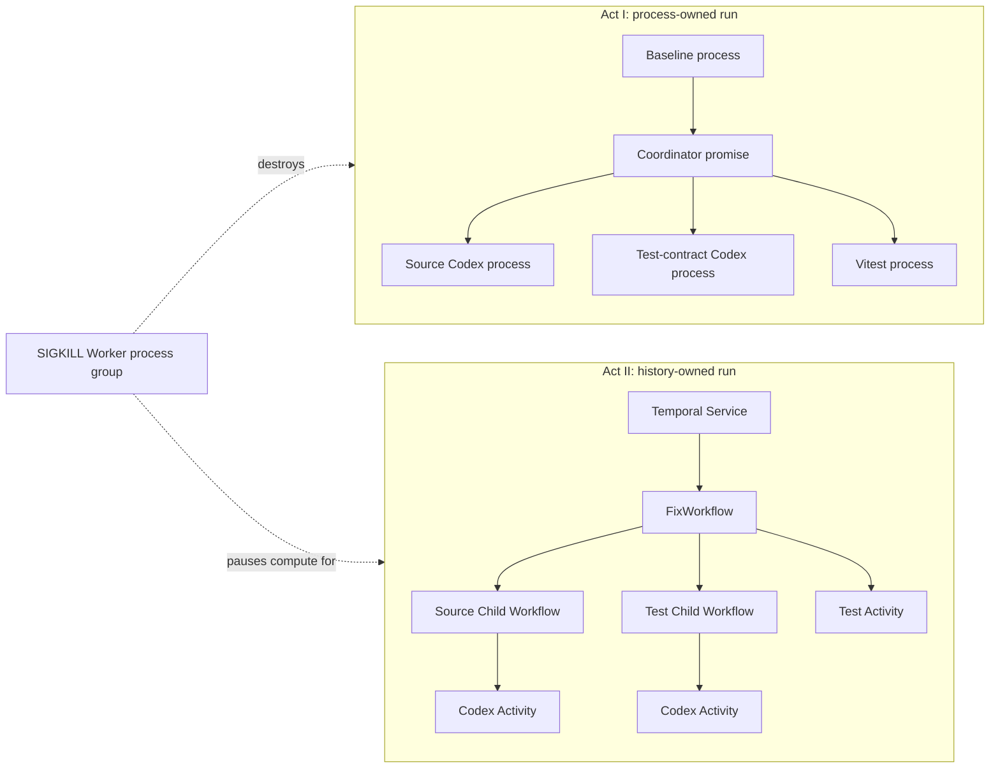

# How the durable agent tree works

This demo answers one question: who owns an agent run after the process that
started it disappears?

In Act I, one Node.js process owns the plan, the active Codex threads, and the
promises that connect each step. Killing that process destroys the run.

In Act II, a Temporal Workflow owns the sequence of steps. Workers provide
compute, Codex threads provide conversation context, and a Git workspace holds
the code. Killing the Worker fleet removes compute while the logical run remains
open.

The implementation uses Temporal TypeScript SDK 1.22.0 and Codex SDK 0.147.0.

## The idea in one sentence

**A process is where the work executes; a durable execution is what the work
means, what has completed, and what must happen next.**

That distinction changes recovery from "start over" to "reconstruct the same
run and continue from recorded facts."

## What the demonstration proves

The demonstration provides direct evidence for these claims:

- Two Codex investigators and the initial test run fan out after planning and
  can execute concurrently.
- Killing the baseline process group erases its in-memory orchestration state.
- Killing the Temporal Worker process group leaves the Workflow Execution open.
- A replacement Worker rebuilds Workflow state from Event History.
- A completed Child Workflow supplies its recorded result during replay.
- An interrupted Codex Activity can recover a heartbeated Codex thread ID.
- An interrupted test Activity can recover the list of passed test files and
  skip those files on its next attempt.
- The recovered run produces one source diff and verifies it with four test
  files.

The demonstration leaves several concerns outside its proof boundary:

- Loss of the machine, the local Codex session directory, or the run workspace.
- Loss or restart of the development Temporal server and its storage.
- Recovery of the in-memory API and supervisor registry after the API process
  exits.
- Exactly-once execution of model calls, file edits, or other external effects.
- Correct model reasoning or correct business decisions.

Those boundaries matter. Temporal gives the orchestration a durable source of
truth. The application still owns its external state and the safety of repeated
effects.

## The two trees

The interface contrasts two structures that look similar while they are
running and behave differently after failure.



In Act I, the process tree and the execution tree share one lifetime. The
baseline process holds the continuation: which investigations are running,
which results have arrived, and which step follows.

In Act II, the process tree hosts an execution tree whose identity lives in the
Temporal Service. The
[Event History](https://docs.temporal.io/encyclopedia/event-history) records
Workflow commands and their resulting events. A Worker can replay those events
to reconstruct the Workflow's state after a crash.

## State has several owners

"Temporal makes the agent durable" compresses several different kinds of state
into one phrase. The actual design assigns each kind of state to a system that
can recover it.

| State | Owner | What happens after Worker loss |
| --- | --- | --- |
| Plan, branch structure, and completed results | Temporal Service: Event History | Workflow replay reconstructs the same logical run. |
| In-flight Activity progress | Temporal Service: Activity heartbeat details | A subsequent Activity Task Execution can read the most recently delivered checkpoint. |
| Codex conversation context | Local Codex session | Activity code resumes the thread by ID when the session still exists. |
| Source edits | Isolated Git workspace | Files remain on disk for the replacement Worker. |
| Passed test filenames | Temporal Service: Activity heartbeat details | The next Activity Task Execution skips recorded files. |
| Live run snapshot | Workflow Query plus supervisor heartbeat projection | The API serves a frozen last-known snapshot while Workers are offline. |
| Workflow timeline | Temporal Service: Event Histories | The API can fetch and project recorded spans without Worker compute. |
| Worker PID and process group ID | API supervisor memory | The supervisor targets the exact process group that it created. |

The ownership split explains both the recovery and its limit. Event History
doesn't contain a copy of the Codex session or the Git workspace. It contains
the durable decisions and results that tell application code how to continue.

## One run from start to finish

### Create an isolated workspace

The API asks `FleetSupervisor` to start a run. The supervisor creates a fresh
copy of `fixture/` under `.demo-runs/RUN_ID/workspace`, initializes a Git
repository, and commits the unchanged fixture.

This isolation gives each run a known starting point and makes the final Git
diff a compact execution receipt. The workspace path keeps Codex changes inside
the run fixture.

Act I then starts `src/baseline/process.ts` in a detached process group. Act II
starts `FixWorkflow` in the Temporal Service and launches
`src/temporal/worker.ts` on a run-specific Task Queue.

### Produce a bounded delegation plan

The coordinator starts one read-only Codex turn with a JSON output schema. The
prompt asks for exactly two assignments:

- One investigator inspects `src/retry.ts`.
- One investigator inspects the test contract.

The planner is explicitly told to avoid tools. Its job is decomposition, while
the delegated investigators own repository inspection. Zod validates that the
plan contains exactly two assignments and covers both required focus areas.

### Fan out three independent branches

After validation, the orchestrator starts these operations before awaiting any
result:

1. The source investigation.
2. The test-contract investigation.
3. The initial test run.

The baseline uses three promises inside one process. The Temporal path starts
two Child Workflows and one Activity, then awaits them with `Promise.all`.

Each investigator receives a separate Codex thread. The Child Workflows also
receive stable IDs derived from the parent run ID:

```text
RUN_ID-source-investigator
RUN_ID-test-investigator
```

This structure creates real concurrency in the orchestration graph. Temporal
schedules the branches independently, and Worker capacity determines when each
Activity Task runs. The demo Worker accepts concurrent Activity Tasks, so the
two Codex subprocesses and the test subprocess can overlap.

The initial tests stop at the known failing file. Their purpose is evidence:
the fixture fails for the documented retry limit before any edit occurs.

### Resume the coordinator to implement

After all three branches return, the coordinator enters the implementation
phase. It resumes the planner's Codex thread in `workspace-write` mode and
receives the following context in its prompt:

- The validated diagnosis.
- The source investigator's evidence.
- The test investigator's evidence.
- The initial test output.

The coordinator changes one loop condition from `<=` to `<`. The source and
test investigators remain read-only.

### Verify and collect evidence

The final test Activity runs all four test files one at a time. After each
passing file, it heartbeats the complete list of passed filenames. When all
four pass, `getDiff` reads the Git diff and the Workflow returns the final
`RunSnapshot`.

The screen replaces the live trace with the verified diff. This transition
expresses the run's final movement from activity to evidence.

## What makes a subagent real in this demo

The word *subagent* refers to an independently assigned Codex execution, rather
than a label applied to one coordinator's output.

Each investigator has:

- A bounded assignment from the structured delegation plan.
- A separate Codex thread ID.
- A read-only sandbox.
- Its own streamed thread, tool, reasoning, and message events.
- A distinct node in the UI.
- In Act II, a Child Workflow ID and separate Event History.

The coordinator and implementer are two turns in the same Codex thread. The
coordinator plans first, waits for the independent findings, and resumes with
the gathered evidence. Both investigators run in read-only sandboxes.

The fixture runner follows the same `CodexRunner` interface as the live SDK. It
emits a deterministic thread ID and trace events, then applies the known patch
during the implementation turn. Fixture mode provides predictable stage timing;
Live Codex mode exercises the authenticated SDK and actual streamed events.

## Why Workflows, Child Workflows, and Activities have different jobs

### The parent Workflow owns the sequence

`FixWorkflow` contains the durable control flow:

```text
plan -> investigate and reproduce -> implement -> verify -> collect diff
```

Workflow code must make the same decisions when it sees the same history.
Temporal therefore
[replays Workflow code](https://docs.temporal.io/workflows#how-workflow-replay-works)
to rebuild state instead of restoring a memory snapshot.

The demo disables the Worker's Workflow cache with `maxCachedWorkflows: 0`.
That setting keeps the demonstration focused on history-based reconstruction.

### Child Workflows give delegated work durable identity

The source and test investigations are Child Workflows. Each child has a stable
Workflow ID, its own Event History, and one Codex Activity.

Child Workflows provide more than code organization. They let the presentation
show that a completed delegated branch remains completed when another branch is
interrupted. Temporal records Child Workflow lifecycle events in the parent's
history and the child's detailed work in its own history. The TypeScript SDK's
[`executeChild`](https://docs.temporal.io/develop/typescript/workflows/child-workflows)
API starts a child and resolves with its result.

The demo uses `ParentClosePolicy.REQUEST_CANCEL`. If the parent closes while a
child remains open, Temporal requests cancellation of that child. Worker loss
doesn't close the parent, so the policy doesn't activate during the central
demonstration.

For Live Codex, the Activity also passes Temporal's Activity cancellation
signal to the Codex SDK's streamed turn. This connection gives an explicit
Temporal cancellation request a path into the model call. The presentation's
`SIGKILL` failure bypasses graceful cancellation; the heartbeat timeout and
retry policy handle that failure path.

### Activities contain effects

Codex calls, file access, Git commands, and test subprocesses can produce
different results each time they run. The project puts these operations in
Activity Definition code, outside the deterministic Workflow Definition.

When an Activity Function returns, the Worker reports its result to the
Temporal Service. The Service records an `ActivityTaskCompleted` event and the
result in Event History. Workflow replay reuses that result and doesn't execute
the completed Activity Definition again. A Retry Policy can schedule another
Activity Task Execution after an earlier attempt fails or times out. For more
information, see the
[Temporal Activity model](https://docs.temporal.io/activities).

The demo configures these Activity policies:

| Policy | Value | Effect |
| --- | --- | --- |
| Start-to-close timeout | 10 minutes | Bounds one Activity Task Execution. |
| Heartbeat timeout | 20 seconds | Detects an Activity Task Execution that stops reporting progress. |
| Initial retry interval | 1 second | Schedules the first retry after a short delay. |
| Maximum retry interval | 10 seconds | Caps retry backoff. |
| Maximum attempts | 5 | Bounds the number of Activity Task Executions. |

If `runCodexTurn` exhausts all five Activity Task Execution attempts, the
Workflow recognizes Temporal's `MAXIMUM_ATTEMPTS_REACHED` failure state and
records four retries in the failed snapshot. The retry counter therefore
remains consistent with Event History on successful and exhausted execution
paths.

Each `runCodexTurn` Activity Execution also holds a five-second heartbeat lease.
Its Activity code sends one heartbeat before it starts the Codex call, then
repeats its current heartbeat payload every five seconds until the call settles.
Thread-ID and progress events still trigger immediate heartbeats. The lease prevents a
quiet model turn from crossing the 20-second heartbeat timeout; it doesn't
claim that the model made new progress during each interval.

After `SIGKILL`, the in-flight Activity Task Execution remains assigned until
the Temporal Service detects a missed heartbeat. The replacement Worker can
sit ready during that interval. Recovery of the Activity Execution begins
after the timeout and retry scheduling, so **Restart workers** doesn't imply
instant continuation.

## How live progress reaches the screen

The live execution trace has two paths because in-flight progress and completed
results have different durability.

### The baseline path

The Codex SDK emits structured events such as `thread.started`, `item.updated`,
`item.completed`, and `turn.completed`. `LiveCodexRunner` normalizes those
events into stable trace entries. An item keeps the same trace ID while its
status changes from running to complete or failed. `RunSnapshot` updates that
entry in place and retains the most recent 24 entries, so one tool call doesn't
appear as several unrelated events.

`BaselineOrchestrator` applies each trace entry directly to its in-memory
`RunSnapshot`. The baseline process writes snapshots to standard output with a
`DEMO_SNAPSHOT` prefix. The supervisor parses those lines and serves the most
recent snapshot to the browser.

Every part of that progress path depends on the baseline process. The API keeps
the last snapshot after the process dies, but the snapshot contains no durable
continuation.

### The Temporal path while an Activity Execution is running

The Workflow waits for an Activity Execution result, so it cannot receive
intermediate Activity events as normal return values. `runCodexTurn` instead
puts the most recent progress event, role, and thread ID in Activity heartbeat
details.

The supervisor inspects pending Activities for three Workflow IDs: the parent
and both children. It decodes each heartbeat and overlays the progress onto its
cached snapshot. This progress view is an external projection of Temporal's
pending Activity state. The running Workflow doesn't read its own heartbeat
details.

The supervisor applies this projection only while the cached run is
nonterminal. The browser also stops polling after `complete` or `failed`. These
guards prevent a late pending-Activity heartbeat from changing a terminal node
back to `running`.

Temporal SDKs can throttle heartbeat delivery. The Worker uses a 500 ms maximum
and default throttle interval for presentation responsiveness. The UI polls the
API every 650 ms, so the trace is live evidence with subsecond intent rather
than a complete event log.

### The Temporal path after an Activity Execution completes

`runCodexTurn` also returns its last 24 trace events as part of the Activity
Execution result. The parent Workflow deterministically applies those entries
to its `RunSnapshot`. The Temporal Service records the result in an
`ActivityTaskCompleted` Event for Workflow replay.

The distinction is precise:

| Information | Meaning | Recovery use |
| --- | --- | --- |
| Streamed Codex event | A local observation from the running SDK process | Builds the current node and trace display. |
| Heartbeat detail | The most recently delivered progress checkpoint in the Temporal Service | Helps a subsequent Activity Task Execution resume. |
| Activity Execution result | A completed operation recorded in Event History | Reused during Workflow replay. |

The
[Activity heartbeat documentation](https://docs.temporal.io/encyclopedia/detecting-activity-failures#activity-heartbeat)
describes the same boundary. Heartbeat payloads can checkpoint progress for a
subsequent Activity Task Execution. A Workflow cannot read that payload while
the Activity Execution is still running.

### The agent consoles and Workflow timeline

The **Agent consoles** dialog renders the current `RunSnapshot.trace` as four
xterm panes, one for each logical job. It replays the trace entries present
when the dialog opens and follows snapshot updates while the UI polls. These
panes are a read-only projection; they aren't direct, interactive subprocess
terminals.

The **Workflow timeline** is available only for Temporal runs. The API fetches
the parent and Child Workflow Event Histories and groups Workflow and Activity
events into execution spans. The dialog polls this projection once per second.
Because this path reads Event History instead of issuing a Workflow Query, it
continues to work while the Worker fleet is offline.

## What happens when the fleet dies

### Act I: the process owns the continuation

The supervisor launches the baseline orchestrator as the leader of a detached
process group. Codex and Vitest subprocesses inherit that group.

Before sending `SIGKILL`, the supervisor verifies all of the following:

- The target carries the supervisor's private ownership token.
- The PID is a safe positive integer above 100.
- The recorded process group ID equals the group leader's PID.

The supervisor then signals the negative process group ID, which targets that
exact group. The API process remains alive and freezes the last known snapshot.

When you click **Restart workers**, the baseline path reuses the supervisor's
run ID but creates a fresh fixture workspace and initial snapshot. Counters
return to zero because the ID is registry metadata; no durable system recorded
the baseline continuation.

### Act II: Event History owns the continuation

The same kill operation removes the Temporal Worker, Codex subprocesses, and
Vitest subprocesses. The Temporal Service runs outside that process group.

The open Workflow Execution retains these facts:

- The delegation plan completed.
- Both Child Workflows started.
- Any completed child supplied a result.
- The current Activity was scheduled.
- The most recent heartbeat reached the Temporal Service.

The supervisor captures pending heartbeat details, marks running nodes as
interrupted for the frozen screen, and leaves the Workflow ID and workspace
unchanged.

When replacement Workers start, they poll the same run-specific Task Queue.
Workflow replay executes `FixWorkflow` from the beginning while substituting
recorded results for completed operations. After failure detection, the Retry
Policy can schedule another Activity Task Execution for the interrupted
Activity Execution.

### Codex recovery

Every Codex Activity heartbeats its thread ID when the SDK emits
`thread.started`. It updates the heartbeat after each progress event, and its
five-second lease repeats the current payload while the turn is quiet.

On retry, the Activity reads the heartbeated thread ID and calls
`resumeThread`. The code submits the durable assignment again in a new turn with
the earlier conversation available. It doesn't resume an interrupted token
stream or continue after the exact last item; the thread ID is the only
recovery key.

If the local session is missing or unavailable, the Activity starts a
replacement thread with the same durable prompt and current Git workspace. The
replacement preserves the assignment and code state while model work can repeat.

The deterministic fixture runner makes its file edit replay-safe. It applies
the known replacement when the defect is present, accepts the exact fixed state
when an earlier attempt already wrote it, and rejects any other source state.
This compare-and-set behavior covers the failure window between the file write
and the Activity completion event.

### Test recovery

The test Activity runs files in a fixed order. After each passing file, it
heartbeats a copy of the completed filename list.

A later attempt reads that list into a set and skips every recorded filename.
The integration suite proves that each final-phase test file executes once
across a Worker replacement when its checkpoint reaches the Temporal Service.

## The guarantee boundary

Three statements keep the architecture honest.

### Recorded completion is durable orchestration evidence

When the Worker's completion report reaches the Temporal Service, the Service
records an `ActivityTaskCompleted` Event and the Activity Execution result in
Event History. Workflow replay reuses that result and doesn't execute the
completed Activity Definition again.

### A heartbeat is a resumability hint

An Activity Heartbeat reports liveness and can carry application progress. It
doesn't close the Activity Execution. The Worker and Temporal SDK throttle
delivery according to configured intervals. The Temporal Service can therefore
store an earlier checkpoint than the Activity code emitted locally.

### External effects require application safety

An Activity Task Execution can finish an external effect before its Worker
dies. If the Worker's completion report does not reach the Temporal Service, a
later Activity Task Execution can repeat that effect. The
[Activity Execution documentation](https://docs.temporal.io/activity-execution)
describes this failure window.

For an AI agent, a repeated effect might mean:

- Another model call.
- A repeated tool call.
- A second attempt to edit a file.
- A repeated API request.

Production code needs effect-specific controls such as idempotency keys,
compare-and-set writes, unique constraints, operation ledgers, and
reconciliation. Temporal determines what the orchestration tries next. The
application determines whether trying again is safe.

## Important implementation choices

### The API supervisor stays outside the failure zone

The browser needs a surviving control plane to send kill and restart requests.
The API therefore owns the Worker PID, process group ID, workspace path, and
last rendered snapshot outside the killable group.

This design isolates the Worker-failure lesson. It also means that API-process
recovery is a separate production concern. A production control plane needs a
durable run registry and workspace location so it can reconstruct its view from
Temporal and artifact storage.

### Queries require Worker compute

The `snapshot` Query reads state from Workflow code. A Worker must execute that
Query, which explains why the UI shows a frozen cached snapshot while the fleet
is offline. Event History remains durable even when no Worker is available to
answer a Query.

### A domain failure returns as data

`FixWorkflow` catches execution errors and returns a `RunSnapshot` whose phase
is `failed`. From Temporal's platform perspective, the Workflow function
returned a result and the Workflow Execution can close as Completed.

This demo choice gives the UI a stable result shape. Production monitoring that
relies on Temporal close status alone misses the domain failure. A
production design must choose deliberately between returning a domain outcome
and failing the Workflow Execution.

When a run fails, the snapshot keeps completed nodes as evidence and marks all
other nodes as failed. The supervisor then stops projecting pending heartbeat
data onto that terminal snapshot.

### The Task Queue is unique to the run

Each run uses `durable-agent-tree-RUN_ID` as its Task Queue. The run-specific
queue isolates the Worker fleet for the presentation's kill operation. A
production system typically groups compatible workloads on stable Task Queues
and uses Workflow IDs for individual execution identity.

### The development server is part of the demo boundary

The Docker Compose configuration runs a local Temporal Service through the
development server without a mounted persistence volume. The Service survives
the Worker process kill that the presentation performs. The demonstration
makes no claim about server, container, disk, or machine recovery.

## Read the screen as evidence

Each UI element answers one architectural question.

| UI element | Question it answers |
| --- | --- |
| Worker fleet status | Is compute available? |
| Node status and thread receipt | Which logical branch is active, and which Codex session backs it? |
| Attempt number | Has Temporal scheduled another Activity Task Execution? |
| Live execution trace | Are independent threads and tools producing real progress? |
| Agent consoles | What work did each logical job report before and after the console opened? |
| Workflow timeline | Which parent, child, and Activity spans are recorded in Event History? |
| Recorded and retried turn counters | Which model turns completed, and how much retry occurred? |
| Test checkpoint | How much file-level verification can a retry reuse? |
| Ownership note | Which system holds the run state for the selected mode? |
| Frozen snapshot stamp | Is this a current query result or the API's last known view? |
| Final diff | Did the run produce a bounded, inspectable code effect? |

The most important visual change occurs after the same physical failure:

- Act I says **Memory is gone.** Restart creates a new run.
- Act II says **History is waiting.** Restart supplies new compute to the same
  run.

### Run controls separate run state from Worker state

The supervisor stops a run-specific Temporal Worker after it observes a
terminal Workflow result. It waits for the process to close, marks the fleet
offline, and returns the terminal snapshot. The browser can then offer a new run
without exposing a cleanup action for completed work.

| Situation | Primary action | Meaning |
| --- | --- | --- |
| No run exists | **Start run** | Create an isolated workspace and launch the selected runtime. |
| A nonterminal run has Workers | **Kill workers** | Stop the recorded process group. |
| A nonterminal run is frozen | **Restart workers** | Restore compute; Temporal continues the same run, while the baseline starts again from an empty in-memory snapshot. |
| A terminal run has no Workers | **Start new run** | Choose the runner and create a separate execution. |

The browser stores the selected mode, runner, and run IDs in local storage. On
page refresh, it asks the surviving API supervisor for fresh snapshots instead
of treating browser storage as execution state. If the API restarts, its
in-memory run registry is gone and stale browser run IDs are discarded.

## Five sentences to remember

1. A Worker executes a Workflow; the Worker doesn't own the Workflow's identity.
2. Event History records durable facts, and replay rebuilds Workflow state from
   those facts.
3. Child Workflows give delegated branches durable identities and separate
   histories.
4. Activities contain external effects, while heartbeats checkpoint in-flight
   progress for later attempts.
5. Temporal owns orchestration recovery; the application owns idempotency,
   artifacts, model correctness, and safe external effects.

## Questions an audience is likely to ask

### Independent investigators

Yes. Each investigator runs a separate Codex thread with its own assignment,
sandbox, streamed events, and result. In Act II, each also runs inside a
separate Child Workflow.

### Child Workflow durability

The Child Workflow makes the delegated branch durable. Its Codex call remains an
Activity because the call is an external, nondeterministic effect. Activity
completion becomes durable; an interrupted attempt can retry.

### Conversation storage

The local Codex session stores conversation context. Temporal stores the thread
ID as heartbeat data and later records the Activity result. Machine loss can
remove the local session in this demonstration.

### Model calls during replay

Workflow replay reuses a completed Activity Execution result and doesn't call
the model. An incomplete Activity Execution can receive another Activity Task
Execution, which can make another model call.

### The Git workspace's role

Event History is an orchestration log rather than an artifact store. The Git
workspace holds the source state that an Activity reads and changes. A
production design must put required artifacts on durable shared storage.

### Heartbeat visibility

The supervisor calls Temporal's describe API for the parent and Child Workflows,
reads pending Activity heartbeat details, and overlays them onto the UI
snapshot. This presentation projection sits outside Workflow logic.

### Presentation thesis

Use this line:

> The bounded repair and tools are the same in both acts. The owner of progress
> changes.

Then show the proof in this order: parallel agents, physical process kill,
frozen state, recorded Event History, replacement Workers, preserved Workflow
ID, completed tests, and the final diff.

## Source map

Use these files to connect the mental model to the implementation:

| Concern | Source |
| --- | --- |
| Baseline control flow and live progress | [`src/baseline/orchestrator.ts`](../src/baseline/orchestrator.ts) |
| Temporal parent and Child Workflows | [`src/temporal/workflows.ts`](../src/temporal/workflows.ts) |
| Heartbeating Codex and test Activities | [`src/temporal/activities.ts`](../src/temporal/activities.ts) |
| Worker and heartbeat-throttle configuration | [`src/temporal/worker.ts`](../src/temporal/worker.ts) |
| Live Codex SDK event translation | [`src/codex/live-runner.ts`](../src/codex/live-runner.ts) |
| Agent console projection | [`src/ui/AgentConsole.tsx`](../src/ui/AgentConsole.tsx) |
| Workflow timeline UI | [`src/ui/WorkflowTimeline.tsx`](../src/ui/WorkflowTimeline.tsx) |
| Event History timeline projection | [`src/temporal/timeline.ts`](../src/temporal/timeline.ts) |
| Deterministic stage runner | [`src/codex/fixture-runner.ts`](../src/codex/fixture-runner.ts) |
| Snapshot and trace projection | [`src/shared/run-snapshot.ts`](../src/shared/run-snapshot.ts) |
| File-level test checkpoints | [`src/shared/checkpointed-tests.ts`](../src/shared/checkpointed-tests.ts) |
| Process-group lifecycle and heartbeat projection | [`src/supervisor/fleet-supervisor.ts`](../src/supervisor/fleet-supervisor.ts) |
| Presentation UI | [`src/ui/App.tsx`](../src/ui/App.tsx) |
| Run-control state machine | [`src/ui/run-control-state.ts`](../src/ui/run-control-state.ts) |
| Real Worker-replacement proofs | [`tests/temporal-recovery.integration.test.ts`](../tests/temporal-recovery.integration.test.ts) |
| Browser-level two-act proof | [`e2e/presentation.spec.ts`](../e2e/presentation.spec.ts) |
| Browser-level agent-console proof | [`e2e/agent-console.spec.ts`](../e2e/agent-console.spec.ts) |

For the spoken sequence, use
[Talk track and exact live-demo script](talk-track.md).
For diagrams and the compact ownership ledger, use
[Architecture and state ownership](architecture.md).
