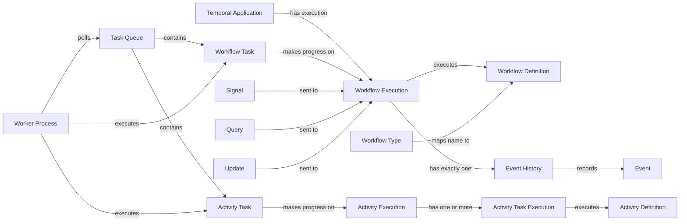

# Temporal taxonomy map

This map is the readable view of `temporal.ttl`. It separates kinds of concepts that
are often compressed into the words “Workflow,” “Activity,” and “Worker.”

## Top-level taxonomy

```text
Temporal Concept
├── Platform Structure
│   ├── Temporal Platform
│   ├── Temporal Service
│   │   ├── Temporal Server
│   │   ├── Persistence Store
│   │   └── Visibility Store
│   └── Namespace
├── Application Structure
│   ├── Temporal Application
│   ├── Definition
│   │   ├── Workflow Definition
│   │   └── Activity Definition
│   ├── Type
│   │   ├── Workflow Type
│   │   └── Activity Type
│   ├── Temporal SDK
│   ├── Temporal Client
│   ├── Programming Constraint
│   │   ├── Workflow Determinism
│   │   └── Replay Compatibility
│   └── Application Safety Concept
│       ├── External Effect
│       └── Idempotency
├── Runtime Structure
│   ├── Execution
│   │   ├── Workflow Execution
│   │   ├── Activity Execution
│   │   │   ├── Workflow-Invoked Activity Execution
│   │   │   └── Standalone Activity Execution
│   │   └── Task Execution
│   │       ├── Workflow Task Execution
│   │       └── Activity Task Execution
│   ├── Task
│   │   ├── Workflow Task
│   │   ├── Activity Task
│   │   ├── Nexus Task
│   │   └── Local Activity Task
│   ├── Event History
│   ├── Event
│   ├── Command
│   ├── Failure
│   │   └── Non-Determinism Failure
│   ├── Payload
│   ├── Task Queue
│   └── Worker Component
│       ├── Worker Program
│       ├── Worker Process
│       └── Worker Entity
├── Workflow Interaction
│   ├── Signal
│   │   └── Signal-With-Start
│   ├── Query
│   └── Update
├── Execution Policy
│   ├── Retry Policy
│   └── Timeout
│       ├── Schedule-To-Close Timeout
│       ├── Schedule-To-Start Timeout
│       ├── Start-To-Close Timeout
│       ├── Workflow Execution Timeout
│       ├── Workflow Run Timeout
│       └── Workflow Task Timeout
├── Platform Capability
│   ├── Durable Execution
│   ├── Visibility
│   ├── Replay
│   ├── Continue-As-New
│   ├── Activity Heartbeat
│   ├── Side Effect (recorded SDK mechanism)
│   └── Asynchronous Activity Completion
├── Identifier
│   ├── Workflow Id
│   ├── Run Id
│   ├── Activity Id
│   ├── Task Token
│   └── Build Id
├── Operational Concept
│   ├── Worker Task Slot
│   ├── Slot Supplier
│   │   ├── Fixed Size Slot Supplier
│   │   ├── Resource Based Slot Supplier
│   │   └── Custom Slot Supplier
│   ├── Worker Tuner
│   ├── Task Poller
│   ├── Workflow Cache
│   ├── Eager Task Execution
│   │   ├── Eager Activity Start
│   │   └── Eager Workflow Start
│   ├── Worker Performance Metric
│   ├── Versioning Strategy
│   │   ├── Patching Strategy
│   │   ├── Workflow Type Versioning Strategy
│   │   └── Worker Versioning Strategy
│   ├── Worker Deployment
│   ├── Versioning Behavior
│   ├── Verification Practice
│   │   └── Replay Test
│   ├── Task Queue Priority
│   ├── Task Queue Fairness
│   └── Release Stage
└── Design Pattern
    ├── Task Orchestration Pattern
    ├── Workflow Messaging Pattern
    ├── Entity and Lifecycle Pattern
    ├── External Interaction Pattern
    ├── Distributed Transaction Pattern
    ├── Error Handling and Retry Pattern
    ├── Batch Processing Pattern
    ├── QoS and Throughput Pattern
    ├── Performance and Latency Pattern
    ├── Worker Configuration Pattern
    └── AI Application Pattern
```

## Central relationship map



## Precise language

| Convenience term | Precise alternatives | Agent rule |
| --- | --- | --- |
| Workflow | Workflow Definition, Workflow Type, Workflow Execution | Name the code, registered name, or running durable execution explicitly. |
| Activity | Activity Definition, Activity Type, Activity Execution | Name the code, registered name, or full execution chain explicitly. |
| Worker | Worker Program, Worker Process | Use Worker Entity when discussing the individual poller bound to a Task Queue. |
| Temporal Cluster | Temporal Service | Treat Cluster as a phased-out term and use Service for the backend. |
| Activity Implementation | Activity Definition | Use Definition for the registered Temporal code concept. |
| Side Effect | Recorded Side Effect, External Effect | Name the Temporal SDK mechanism or the external change explicitly. |

## Design-pattern taxonomy

The following entries are individuals of their pattern-category classes.

| Category | Patterns |
| --- | --- |
| Task orchestration | Child Workflows; Parallel Execution; Pick First (Race) |
| Workflow messaging | Signal with Start; Request-Response via Updates |
| Entity and lifecycle | Entity Workflow; Continue-As-New; Updatable Timer |
| External interaction | Polling External Services; Long-Running Activity; Delayed Start; Delayed Callback; Approval |
| Distributed transaction | Saga Pattern; Early Return |
| Error handling and retry | Fixed Count of Retries; Fixed Wall-Time Retries; Non-Retryable Errors; Delayed Retry; Fast/Slow Retries; Retry Alerting via Metrics; Resumable Activity |
| Batch processing | Fan-Out with Child Workflows; Batch Iterator; Sliding Window; MapReduce Tree |
| QoS and throughput | Downstream Rate Limiting; Priority Task Queues; Fairness |
| Performance and latency | Local Activities; Early Return with Local Activities; Eager Workflow Start |
| Worker configuration | Worker-Specific Task Queues; Activity Dependency Injection |
| AI application, sourced from the Temporal Developer skill | LLM Calls in Activities; Non-Deterministic Tools in Activities; Deterministic Agent State in Workflow; Centralized Activity Retry Management; Multi-Agent Orchestration |

The first ten categories and their 34 entries come from the Temporal Design Patterns
catalog. The AI Application category and its five entries come from the reviewed
Temporal Developer skill and remain visibly separate from that catalog.

## Agent integration

The [agent usage guide](./agent-usage.md) turns this taxonomy into a retrieval layer.
It normalizes ambiguous terms, identifies the Workflow/Activity/external-effect
boundary, and then routes the agent to the smallest relevant bundle of upstream core
and SDK references. The [skill review](./temporal-developer-skill-review.md) records
the comparison and the upstream guidance that needs refinement before reuse.

## Boundaries and pending extensions

This version makes four deliberate cuts:

1. It models concepts from the five supplied Temporal pages plus selected concepts
   from the pinned Temporal Developer skill. It does not claim full coverage of
   either corpus.
2. It models pattern membership and named primitives. It does not yet formalize
   pattern preconditions, trade-offs, or incompatibilities.
3. It models Worker performance concepts from the guide overview. Detailed metric
   names, configuration keys, SDK differences, and release availability belong in a
   later operational module.
4. It keeps Chaos City concepts separate. A later alignment module can state that a
   City Project is orchestrated by a Workflow Execution or that a Work Order is
   implemented through an Activity without redefining either vocabulary.

## Proposed next questions

- Should the ontology optimize first for teaching, agent retrieval, consistency
  checking, or code generation?
- Should pattern applicability become OWL axioms, SHACL rules, or plain decision
  guidance?
- Which Temporal documentation release or review cadence should ontology versions
  track?
- Should the next module map Chaos City terms, TypeScript SDK APIs, or production
  operations?
